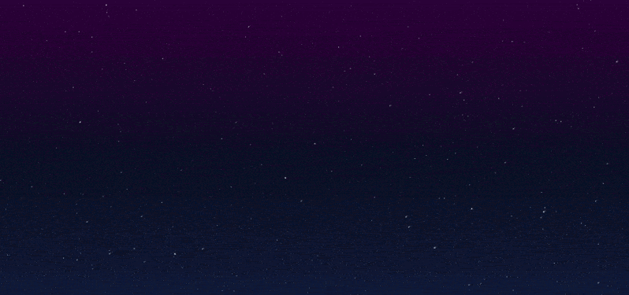

# Lively Wallpapers Collection

A collection of animated wallpapers designed for **Lively Wallpaper**.

All wallpapers are built using **HTML5 Canvas and JavaScript**.

They are lightweight, customizable, and run smoothly as live desktop wallpapers.

---

# Wallpapers

## Starfield

Animated deep-space background with thousands of stars and falling stars.

Location:

```
Starfield/
```

Preview:



---

More wallpapers will be added in the future.

---

# How to Use

1. Install **Lively Wallpaper**
2. Open Lively
3. Click **Add Wallpaper**
4. Select any `index.html` file from a wallpaper folder

Example:

```
starfield/index.html
```

---

# Technologies

- HTML5
- JavaScript
- Canvas API

---

# License

MIT License
